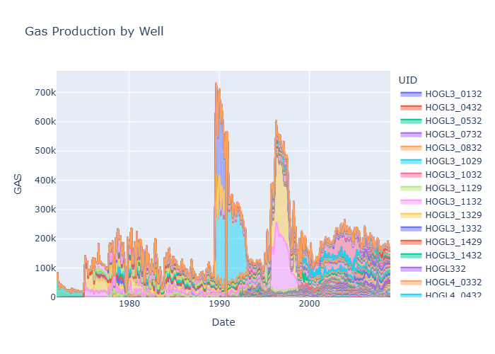
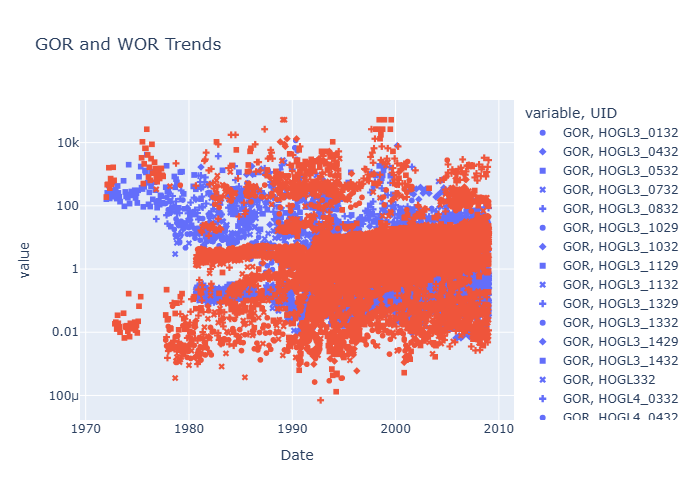
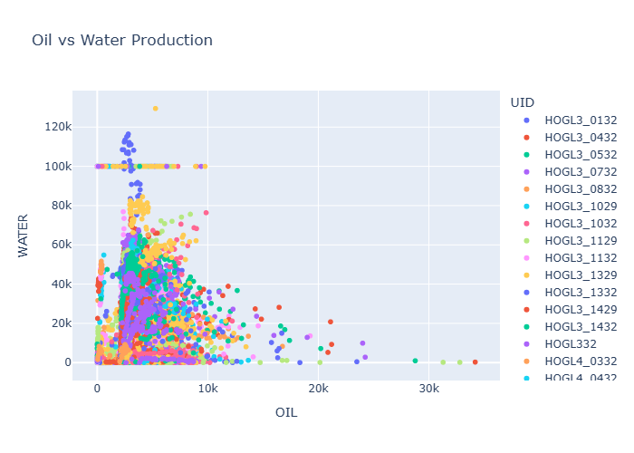

# Oil_field_Production_aggregation
This project analyzes oil field production data to evaluate well performance and identify key production trends.  The analysis focuses on oil, gas, and water production, along with derived indicators such as Gas-Oil Ratio (GOR) and Water-Oil Ratio (WOR), which are critical for monitoring reservoir behaviour and production efficiency.

# Oil Field Production Analysis

## Overview
This project analyzes oil field production data to evaluate well performance and identify production trends using Python.

## Objectives
- Analyze oil, gas, and water production trends  
- Calculate key performance indicators (GOR and WOR)  
- Identify signs of reservoir changes such as water breakthrough  

## Tools & Technologies
- Python  
- Pandas  
- Plotly  

## Key Features
- Data preprocessing and feature engineering  
- Calculation of Gas-Oil Ratio (GOR) and Water-Oil Ratio (WOR)  
- Visualization of production trends across wells  

## Sample Visualizations

### Gas Production by Well

### GOR and WOR Trends

### Oil vs Water Relationship

## Key Insights
- Declining production trends observed in some wells  
- Increasing WOR indicates potential water breakthrough  
- GOR variations reflect differences in reservoir behaviour  
- Data-driven insights can support production optimisation  

## Data
The dataset used in this project is not publicly available.  
A sample dataset is provided for demonstration purposes.

## Project Structure
